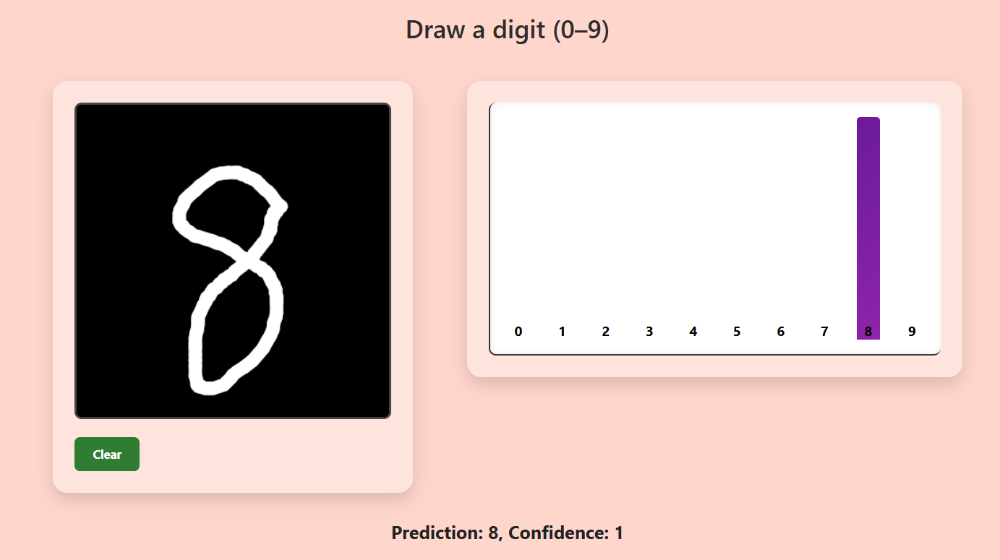
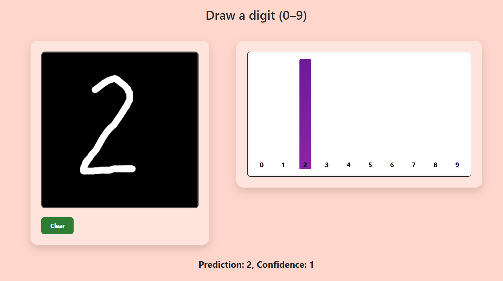
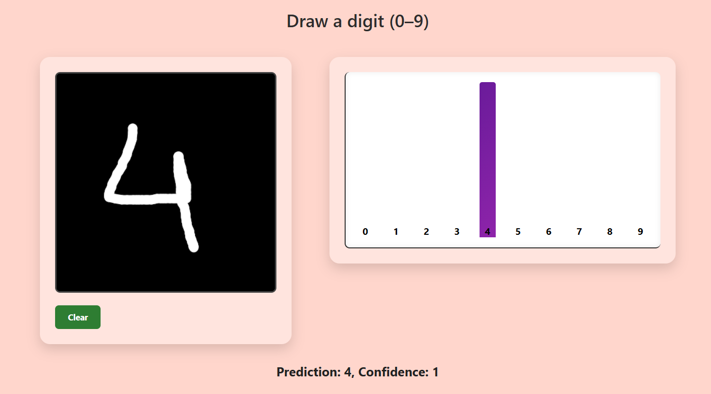

# ✋ Handwritten Digit Recognition Web App


An interactive web app that uses a Convolutional Neural Network (CNN) to recognize handwritten digits drawn on a canvas. Built using Flask, TensorFlow, and JavaScript, this app combines deep learning with frontend visualization to predict digits in real time.

---

## 📽️ Working App Snaps





---

## 📚 Table of Contents

- [🧠 Model Overview](#-model-overview)
- [🚀 App Features](#-app-features)
- [🛠️ Setup Instructions](#️-setup-instructions)
- [📊 Model Performance](#-model-performance)
- [📁 Project Structure](#-project-structure)
- [📝 License](#-license)

---

## 🧠 Model Overview

We trained two types of models using the [MNIST dataset](http://yann.lecun.com/exdb/mnist/):

### 🔹 ANN (Artificial Neural Network)
- **Input Layer:** Flattened 28x28 pixels
- **Hidden Layers:** Dense (256, 128) + Dropout
- **Output Layer:** Softmax for 10 classes (0–9)

### 🔹 CNN (Convolutional Neural Network)
```python
model = Sequential([
    Conv2D(32, (3, 3), activation='relu', input_shape=(28, 28, 1)),
    MaxPooling2D((2, 2)),
    Conv2D(64, (3, 3), activation='relu'),
    MaxPooling2D((2, 2)),
    Flatten(),
    Dense(128, activation='relu'),
    Dropout(0.5),
    Dense(10, activation='softmax')
])
```
### 🚀 App Features
```python
🎨 Real-time Drawing Canvas
Users draw digits (0–9) on a black canvas.

Prediction updates live with each stroke.

📊 Probability Bar Graph
A dynamic bar chart shows confidence scores for each digit class.

🔁 Reset Button
Clear canvas with one click to retry predictions.

🧠 Backend Intelligence
Pretrained CNN model loads using TensorFlow.

Flask routes handle image preprocessing and prediction.
```
### 🛠️ Setup Instructions
1️⃣ Clone the Repo
```python
git clone https://github.com/yourusername/hand-digit-recognition.git
cd hand-digit-recognition
```
2️⃣ Install Dependencies
```python
pip install -r requirements.txt
```
3️⃣ Run the App
```python
python app.py
```
  ✅ The app will start running at: http://localhost:5000

### 📊 Model Performance
Metric	Value
```python
Accuracy	98.4%
Loss	~0.04
Dataset Used	MNIST
```
</details>
